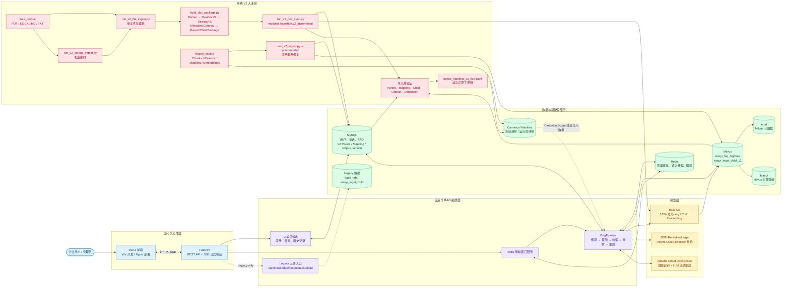
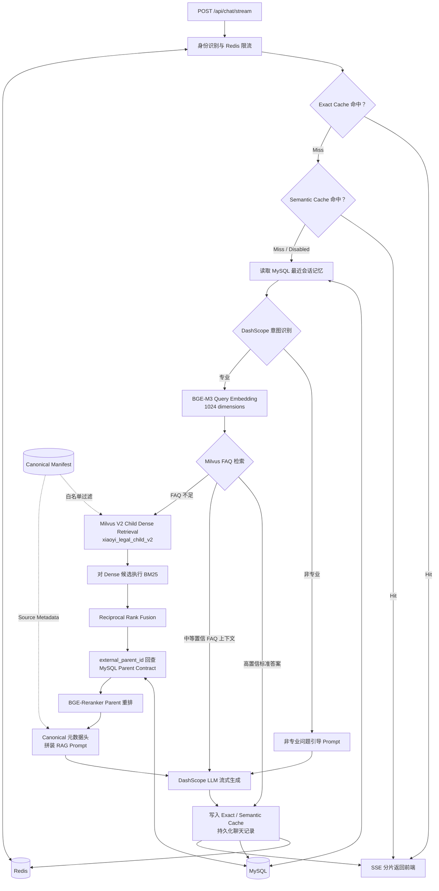
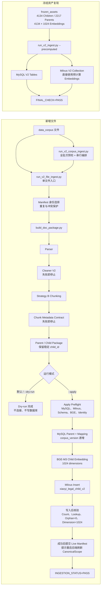
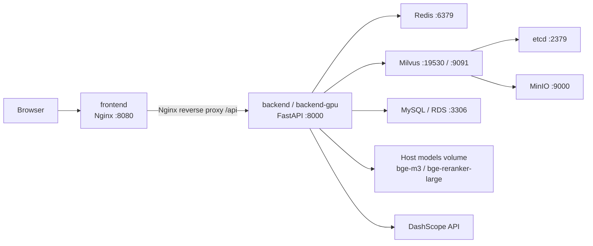

# Enterprise Legal RAG 项目架构图

本文描述 Enterprise Legal RAG 的在线问答、V2 文档入库、数据存储与 Docker 部署关系。
主检索链路使用 RETRIEVAL_CONTRACT=v2；Legacy 上传入口与 V2 入库链路保持隔离。

## 1. 总体架构

## 2. 在线问答链路

## 3. V2 文档入库链路

## 4. Docker 部署拓扑

## 5. 架构边界

- V2 日常入库只使用 run_v2_file_ingest.py 或 run_v2_corpus_ingest.py。
- frozen_assets 通过 run_v2_ingest.py --precomputed 恢复标准 V2 数据基线。
- /api/knowledge/documents/upload 是 Legacy 入口，不写入 xiaoyi_legal_child_v2。
- V2 检索由 Milvus Child 命中、MySQL Parent 回查、BM25/RRF 融合和 BGE Reranker 组成。
- Live Manifest 只在 MySQL 与 Milvus 写入并核验成功后正式更新。
- Manifest 更新后需要重启后端，使进程缓存的 CanonicalScope 重新加载。
- Milvus 使用 etcd 保存元数据，并使用 MinIO 保存对象数据。
